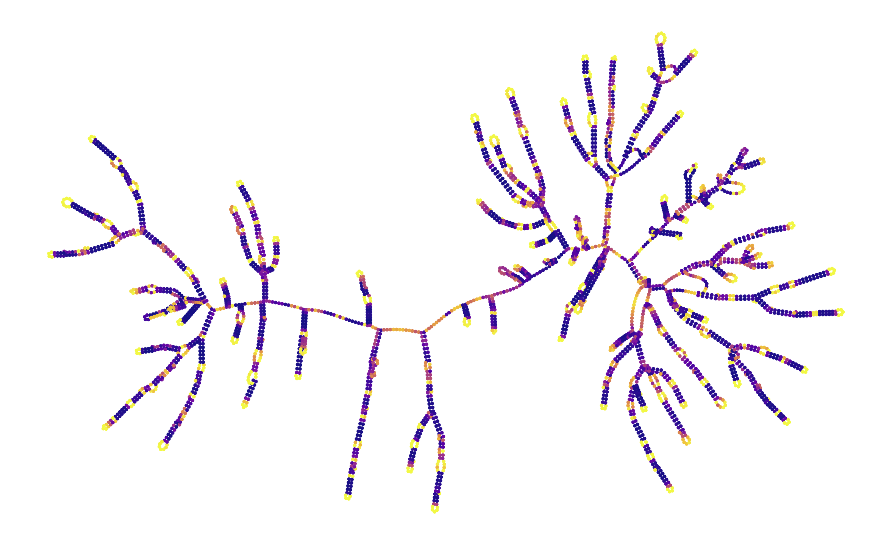
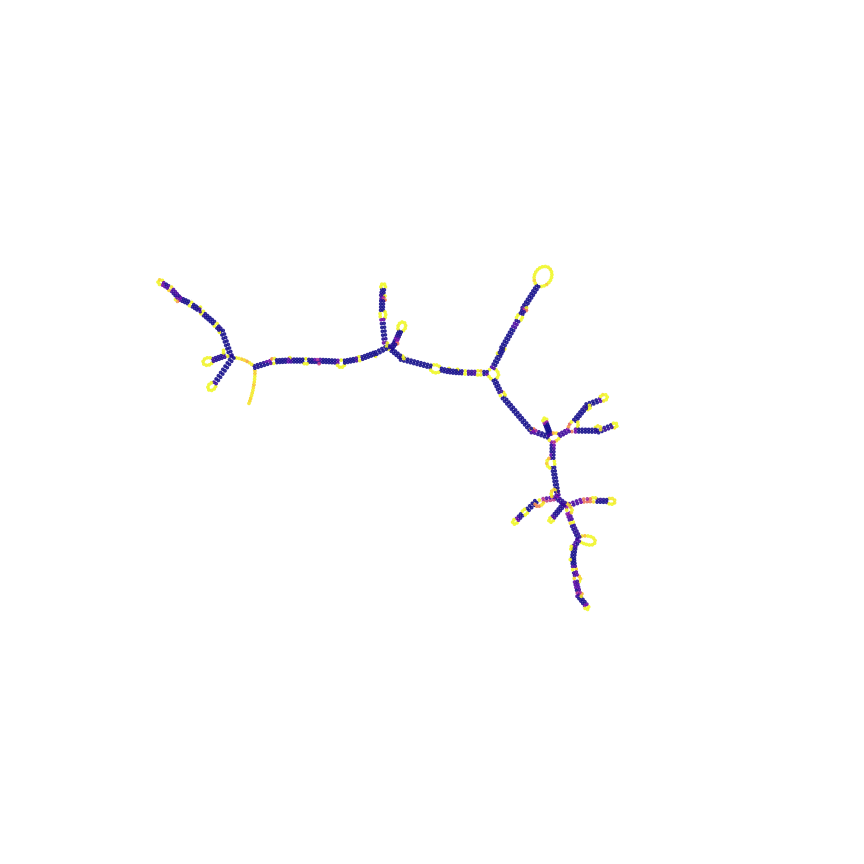
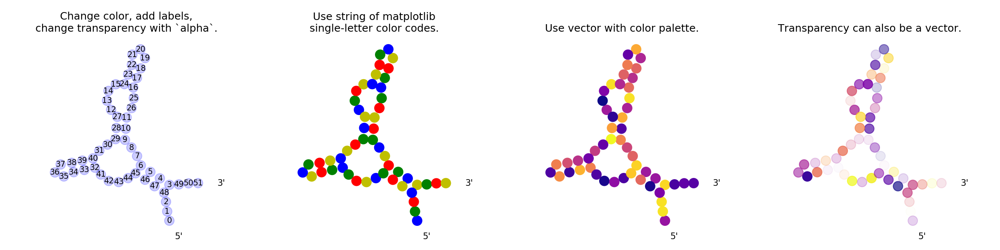
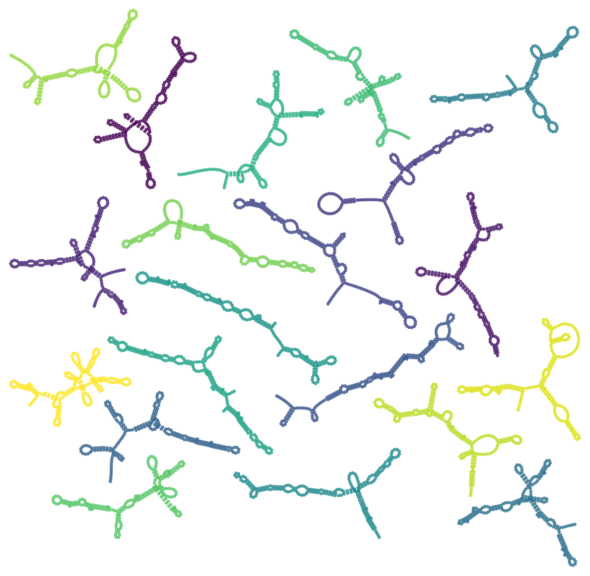

Proposition d'un modèle prédictif de la stabilité des candidats vaccin ARN Covid 19, à partir de leurs séquences et de leurs données structurales :
- Visualisation graphique des séquences et de leurs conformations secondaires grace au package RiboGraphViz
- Exploration et caractérisation des séquences candidates
- Matrices de contact
- Préparation et encodage des données d'entrées
- ACP
- Optimisation et évaluation de différents modèles Deep Learning
  
# RiboGraphViz

Visualize global properties of large RNAs using force-directed layout from GraphViz.

Authors:
* Hannah Wayment-Steele
* Credit to utils from Rhiju Das' ToyFold-1D code.

*Above*: MS2 bacteriophage genome structure, colored by prob(unpaired), calculated in EternaFold.

*Below*: Visualizing the MFE structure and p(unpaired) of an mRNA for eGFP at increasing temperatures in Vienna.


Note: Not intended for detailed layouts -- loops may switch orientation in z-axis.

To set up:
```
pip install -r requirements.txt
python setup.py install
```

See `examples.ipynb` for example usage.



*Below*: Vienna MFE structures of 20 randomly-generated RNAs.

